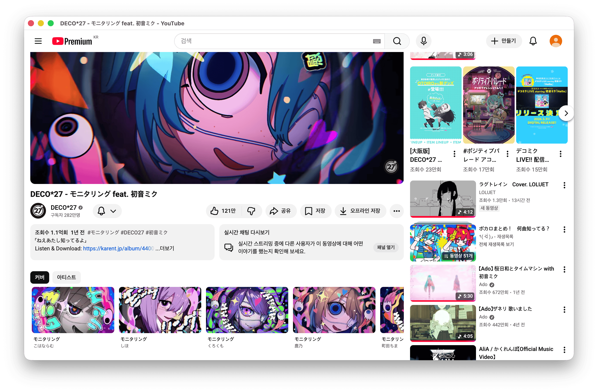

<div align="center">

# 🎵 Kanade Desktop

[](https://github.com/khdkkhdd/kanade-desktop/releases/)
[](./LICENSE)
[](https://github.com/khdkkhdd/kanade-desktop/actions)

A YouTube desktop client for exploring song relations — original recordings,
covers, and the artists behind them — layered on top of the video you're watching.

</div>

<!--  -->

> [!IMPORTANT]
> ### ⚠️ Disclaimer
>
> **No affiliation.** Kanade Desktop is an independent, unofficial project. It is
> not affiliated with, authorized by, endorsed by, or connected to Google LLC,
> YouTube, or any of their subsidiaries.
>
> **Trademarks.** "YouTube" and related marks belong to their respective owners.
> Any reference here is for identification only.
>
> **Liability.** The app is provided "as is". You use it at your own risk.

> [!NOTE]
> ### About this repository
>
> This is the open-source **client** for a personal project I run. The relation
> overlay — the feature that makes the app interesting — talks to a **private
> catalog server** that I curate and maintain myself.
>
> Without access to that server, the app runs as a plain YouTube viewer. If you'd
> like access, see [Request access](#request-access) below.

## Contents

- [What you'll see](#what-youll-see)
- [Download](#download)
- [Request access](#request-access)
- [Also included](#also-included)
- [Languages](#languages)
- [Development](#development)
- [Credits](#credits)
- [License](#license)

## What you'll see

The catalog focuses on **J-pop, Vocaloid, utaite, and V-tuber** music. When the
current video maps to a song in the catalog, a panel appears under the video
with:

- The **original recording** (first release / canonical upload)
- **Alternative uploads** of the same recording — on YouTube and cross-platform
  (niconico, etc.)
- **Covers** and live performances of the same song
- **Artists** involved, each linking to their own catalog page

The overlay only renders when the catalog has data for the current video.
Outside the catalog, it stays hidden and the app behaves like a regular browser
window.

<!-- Screenshot placeholder -->

## Download

> [!NOTE]
> **macOS only for now.** Windows and Linux builds may come later.

Grab the latest DMG from the
[Releases page](https://github.com/khdkkhdd/kanade-desktop/releases):

- `YouTube-<version>-arm64.dmg` — Apple Silicon (M1 and later)
- `YouTube-<version>.dmg` — Intel Macs

Builds are code-signed with a Developer ID and notarized by Apple. Drag to
Applications and open — no Gatekeeper workaround needed.

> [!NOTE]
> The DMG and installed app are named **YouTube** (showing up as `YouTube.app`
> in your Applications folder and Dock), not "Kanade Desktop". This is
> intentional — "Kanade Desktop" is the name of the project; the installed app
> is branded as a native YouTube experience.

## Request access

Two kinds of access, both granted manually.

### Catalog endpoint (for the relation overlay)

If you'd like to use the relation overlay, email [me@dong.kim](mailto:me@dong.kim)
with a short note about what you're interested in. I'll reply with the endpoint
URL and a key.

### Curator role (admin)

The admin UI lets trusted contributors edit the catalog — register videos, link
channels to artists, attach metadata. This is significantly more restricted.
Reach out at [me@dong.kim](mailto:me@dong.kim) if you'd like to help curate.

## Also included

- **Discord Rich Presence.** Shows friends what you're watching, with title,
  artist, and a link back to the video. Works without any server access;
  requires only the Discord desktop app running.
- **Navigation shortcuts.** `⌘L` / `Ctrl+L` to jump to a URL or video ID.
  `⌘[` / `⌘]` for back/forward (also wired to three-finger trackpad swipes
  and mouse side buttons on macOS).
- **State persistence.** Window size, position, and last URL are remembered
  across launches.

## Languages

- 한국어 (Korean) — default
- English
- 日本語 (Japanese)

The admin UI is Korean-only.

## Development

Requirements: Node.js 20 or later (22 recommended), pnpm 10 (enable via
`corepack enable`).

```bash
git clone https://github.com/khdkkhdd/kanade-desktop
cd kanade-desktop
pnpm install
pnpm dev            # run with HMR
pnpm typecheck
pnpm test
pnpm dist:mac       # build a signed DMG locally (requires Apple Developer setup)
```

Releases are driven by tags. Bump `"version"` in `package.json`, tag `v*.*.*`,
push — CI signs, notarizes, and uploads a draft release to GitHub.

## Credits

The plugin loader, main ↔ renderer IPC bridge, and Discord RPC integration are
adapted from [**pear-desktop**](https://github.com/pear-devs/pear-desktop)
(MIT © th-ch). Full attribution in [`NOTICE`](./NOTICE).

## License

[MIT](./LICENSE) © 2026 Dong Kim
